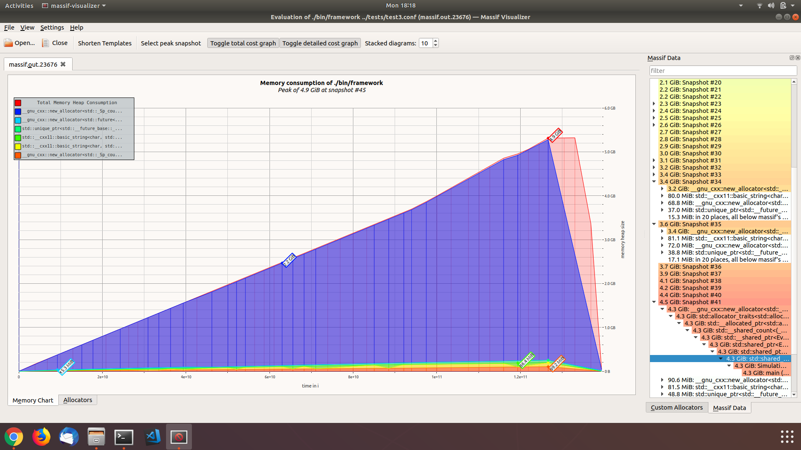
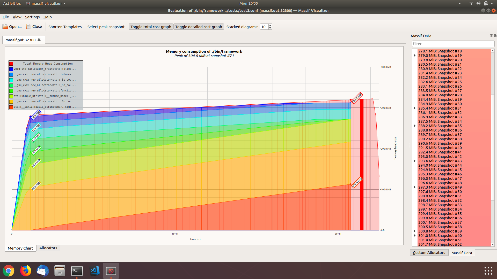
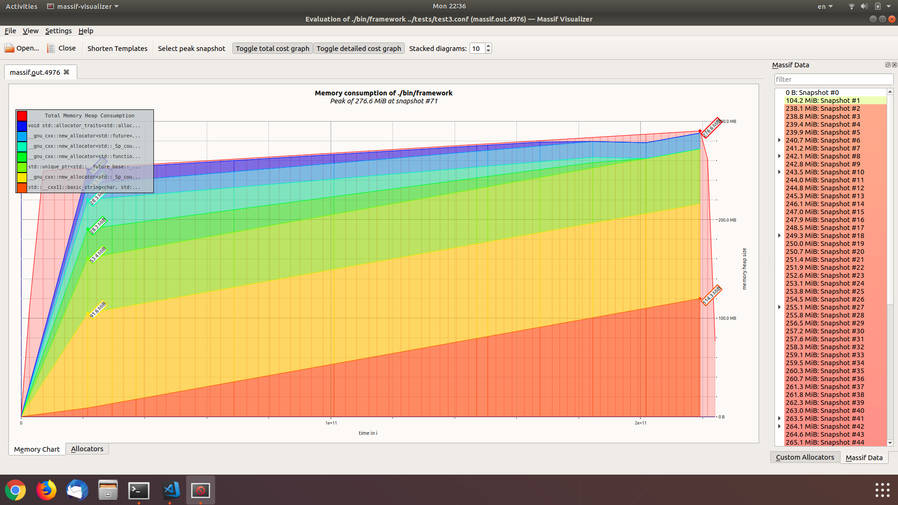

# framework

Basic and minimalistic framework for running simulations written in C++14. Simulation is defined as modules that are executed in a specific order. Each full execution of the modules is called an event. The total simulation is the result of executing a specified number of events.

# Usage
`framework [-v] configuration_file.conf`

Where the configuration file is a basic config file that shall state the following:
1. The number of events to simulate. This can be set using the key `number_of_events`.
2. List of modules to use in the simulation. This can be set using the key `modules`. The available modules can be one of the following -case sensitive names:
  - Module1
  - Module2
  - Module3
  - Module4
  - Module5

Also, optionally you can specify the following:
1. The number of threads to use to execute events in parallel. This can be set using the key `number_of_threads`.
2. Initial seed for the underlying random number generator. This can be set using the key `initial_seed`.

Furthermore, the command line option `-v` print additional information about the execution time of the simulation.

Output of the simulation is written to standard out that can be redirected to a file.

# Examples
Sample configuration files and their respective output in the directory `examples`. There are 3 samples and they are as follows:
1. `example.conf`: This is a basic example that loads 5 modules and execute 10 simulation events.
2. `example_initial_seed.conf`: This example shows how to set the initial seed to reproduce the simulation result. By default the seed used to initialize the underlying random number generator is printed at the beginning of the execution for reference.
3. `example_multithread.conf`: This example shows how to use multiple threads to execute the simulation. This option can significantly reduce execution time.

# Building
The project uses `cmake` to generate build files. Please follow the following steps to build the framework using Unix Makefiles.
`
mkdir build && cd build
cmake -DCMAKE_BUILD_TYPE=Release ..
make`

To execute the tests you can use the following command after building the framework:
`make test`

# Structure
The repository is structured into 3 directories as follows:
1. `src`: contains all source code of the framework.
2. `examples`: contains a set of configuration files examples.
3. `tests`: contains automated functionality tests and also performance tests and benchmarking scripts.
4. `docs`: Mainly images used in this report.

# Architecture
The following are the classes of the framework and their responsibilities:
1. `Event`: This class represent a single event in the simulation run. Events have their unique IDs. Every object will hold the initial seed that is to be used for generating random numbers specific for this event.
2. `Module`: This class is an abstract class that represent a module to run in the simulation. All module implementations must be derived from this class and implement their `Module::run` method that run for each event of the simulation. The module run method accepts an event and a random number generator that it will use to draw random numbers during its execution of this event.
3. `ThreadPool`: A basic thread pool implementation that accepts task submitted by its clients and parallel execution of these tasks.
4. `Simulation`: This class represent a manager that manages all aspects of running a simulation. It loads the required list of modules, prepare the required number of events to simulate and submit the needed task to the `ThreadPool` for execution.
5. `Configuration`: Represents the configuration file.

## How a simulation works?
After reading the configuration file and checking its correctness, a `Simulation` object is created and asked to load the required modules and to initialize it's random number generator of type Mersenne Twister -main random number generator- with the initial seed. This happens in the method `Simulation::init`.

In case all modules were loaded correctly, the main method of running the simulation is called `Simulation::run`. In this method, a `ThreadPool` is initialized with the requested number of threads. Then, the required number of events are constructed as `Event` objects and submitted along with an execution function to the `ThreadPool`.

When each event is created, it is assigned a unique identifier -ID- and given a random number -drawn from the main random number generator `Simulation::random_engine_`- which will be used as a seed for all random numbers generated during the execution of this event. In this way it is guaranteed that the same output will be generated given the same initial seed used to initialize the main random number generator.

Upon submitting events to be executed by the `ThreadPool`, a `std::future` is returned back to `Simulation` object and stored for obtaining the results in the future after submitting and executing all the tasks. Please note here that there is no distinguishing between a simulation executed only in 1 thread or more. All tasks are submitted to the thread pool such that if user didn't require extra number of threads, the thread pool will execute the tasks on the main thread without creating any additional threads.

Finally, simulation results are read from the `std::future` state and written to standard out.

## Design choices
This section will describe some design choices made in implementing the framework. Most importantly, the choice of who owns the random number generator that are used during each events. Since events are run in parallel and the used random number generator is not thread safe so there is a space vs time tradeoff that need to be considered; should we synchronize access to a shared generator or have multiple generators as needed?

### Measurments
To answer this question, 3 approaches were investigated. Furthermore, both memory profiling and execution time benchmarking were used to evaluate each approach and compare it to the others.

To benchmark execution time, a script `tests/performance/test.sh` was created to run simulations with increasing number of events using different number of threads. Results were reported as average of 5 runs of this script.

To profile the memory usage, Valgrind was used along with it's [Massif](http://valgrind.org/docs/manual/ms-manual.html) tool to generate a memory profile of the application. Then visualizations were created using the open source tool [massif-visualizer](https://github.com/KDE/massif-visualizer).

To profile bottlenecks and performance issues, standard linux `perf` tool was used, although, not much was concluded as the framework implementation is minimal and most of the work is done in the random number generator.

All benchmarks used 3 Modules configuration and for the memory profiling the simulation of 1,000,000 events.

### Approaches
The approaches are as follows:
1. Each `Event` object has its own random number generator.

Ths approach seemed to be more intuitive and promising; since there will be no need to use mutexes or locks and who doesn't love lock free multithreading :-) 

In fact this turned to be not the case. The Mersenne Twister random number generator used is a heavy object and the penalty of having multiple copies -as the number of events- of it turned out to be practically impossible. The following is a memory profiling analysis when this approach was used.

As seen from the memory profile, this approach make it really hard to simulate millions of events as the memory consumption would explode. As such, this approach was abandoned in favor of the other ones.

2. Each `Module` object has its own random number generator. Access to this random number generator is synchronized by a per object mutex.

This approach while it doesn't look cool enough since it involve locking, but it dramatically improved the memory consumption and the runtime -which was affected by the growing memory usage and eventually going to swap. Based on the memory profiling analysis of the first approach, the random number generator objects occupied the biggest percentage of memory usage and therefore the biggest memory consumer was eliminated.
The memory profile of this approach is shown in the next picture.

All good, but however, the fact that we are still using a lock for basically the only operation being done didn't look clever. And execution time(ms) of this method can be summarized by the following table -average of 5 runs:

| CPU/Event 	| 100 	| 1000 	| 10000 	| 100000 	| 1000000 	| 10000000  	|
|-----------	|-----	|------	|-------	|--------	|---------	|-----------	|
| 1         	| 8.8 	| 62.2 	| 449   	| 5335.2 	| 53051.2 	| 515359    	|
| 2         	| 3.6 	| 29.4 	| 243.2 	| 3164   	| 30855.4 	| 324893.75 	|
| 4         	| 4.4 	| 25.6 	| 202.4 	| 1974.4 	| 27426.2 	| 295628.5  	|
| 6         	| 3.8 	| 24.2 	| 200.2 	| 2693.6 	| 27800.6 	| 287644.5  	|
| 8         	| 4   	| 22.6 	| 207.2 	| 2241   	| 28415.6 	| 299646    	|

3. Each worker thread has its own random number generator using `thread_local` storage specifier.

This method solves problems in both words. Using the object lifetime storage specifier `thread_local` introduced in C++11, random generators are assigned to each thread. Therefore we only have a few number of this heavy objects equals to the number of threads we are using to execute the simulation and, furthermore, each thread is completely free to use this generator as it is not shared with other threads. In this approach, each thread will initialize the generator using the seed of the specific event it is executing and then pass this generator to the modules to use it.

This approach dramatically improves the performance of the application. The following table show execution time -average of 5 runs:

| CPU/Event 	| 100 	| 1000 	| 10000 	| 100000 	| 1000000 	| 10000000 	|
|-----------	|-----	|------	|-------	|--------	|---------	|----------	|
| 1         	| 3.8 	| 28.8 	| 198.4 	| 1986.6 	| 20099.6 	| 224959.8 	|
| 2         	| 2.4 	| 12   	| 114.6 	| 1268.6 	| 13339.4 	| 150148.4 	|
| 4         	| 1.8 	| 7.8  	| 80.8  	| 907.2  	| 9744.6  	| 109208.8 	|
| 6         	| 2   	| 6.8  	| 67.8  	| 828    	| 8860    	| 102334.4 	|
| 8         	| 1.8 	| 6.8  	| 64    	| 753.4  	| 8347.4  	| 96821.8  	|

Additionally, the following shows the current memory profile of the framework after further memory clean ups.

# Module Development
To add a new module, you have to implement a class derived from the abstract class `Module`. Furthermore, modules are created by a static factory method `Module::createModule` that takes the name of the required module as input and returns the required module as a `std::shared_ptr<Module>`. You will need to update this method accordingly to allow the instantiation of your module.

The main logic of your module should go in the method `Module::run`. One thing to note here, is that events are executed in parallel which implies that your module `run` method should be reentrant and thread safe. Any shared state must be protected by mutexes or similar accordingly.
